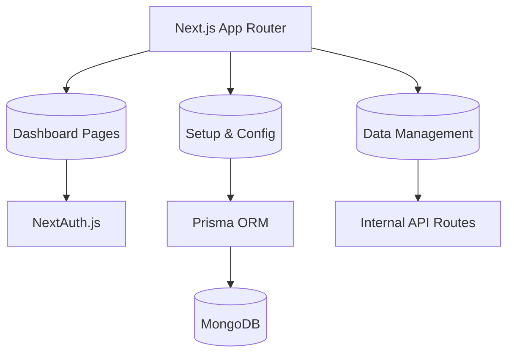

# 🛡️ PheniCar Admin Dashboard

**PheniCar Admin** là trung tâm quản lý dữ liệu và cấu hình hệ thống cấp cao của dự án PheniCar. Được xây dựng trên nền tảng **Next.js 15 (App Router)** và **MUI 6**, ứng dụng cung cấp giao diện quản trị chuyên nghiệp để quản lý đội xe, người dùng, bản đồ và theo dõi hoạt động toàn hệ thống.

---

## 📑 Mục lục

1.  [Tổng quan](#-tổng-quan)
2.  [Các tính năng chính](#-các-tính-năng-chính)
3.  [Công nghệ sử dụng](#-công-nghệ-sử-dụng)
4.  [Kiến trúc hệ thống](#-kiến-trúc-hệ-thống)
5.  [Hướng dẫn cài đặt](#-hướng-dẫn-cài-đặt)
6.  [Cấu hình môi trường](#-cấu-hình-môi-trường)
7.  [Quản lý dữ liệu (Prisma)](#-quản-lý-dữ-liệu-prisma)

---

## 🚀 Tổng quan

PheniCar Admin phục vụ các quản trị viên hệ thống với khả năng quản lý dữ liệu tập trung:
*   **Quản lý Metadata**: Thiết lập mạng lưới điểm dừng (Stations), trạm sạc và ranh giới bản đồ.
*   **Giám sát vận hành**: Xem lịch sử đặt chuyến, phản hồi từ khách hàng và nhật ký hệ thống (Logs).
*   **Quản trị thực thể**: Quản lý danh sách phương tiện, khách hàng và tài khoản nhân viên.
*   **Bảng điều khiển (Analytics)**: Hiển thị các biểu đồ thống kê về hiệu suất hoạt động của đội xe.

---

## ✨ Các tính năng chính

-   **Dashboard & Analytics**:
    -   Biểu đồ thống kê chuyến đi, doanh thu và hiệu suất sử dụng xe (ApexCharts).
    -   Theo dõi các chuyến đi đang diễn ra (Ongoing) thời gian thực.
-   **Quản lý Vận hành (Management)**:
    -   **Robot Taxi**: Quản lý danh sách xe tự hành, trạng thái và thông số kỹ thuật.
    -   **Customer & Users**: Quản lý thông tin khách hàng và phân quyền tài khoản quản trị.
    -   **Booking History**: Lưu trữ và tra cứu lịch sử đặt chuyến chi tiết.
-   **Cấu hình Hệ thống (Setup)**:
    -   **Map Management**: Upload và cấu hình các khu vực hoạt động (GeoJSON).
    -   **Location & Stations**: Thiết lập mạng lưới điểm đón/trả và trạm sạc.
    -   **Vouchers & Obstacles**: Quản lý chương trình khuyến mãi và các vật cản giả lập.
-   **An ninh & Xác thực**:
    -   Hệ thống đăng nhập bảo mật với **NextAuth.js**.
    -   Phân quyền người dùng (Role-based Access Control).

---

## 🛠 Công nghệ sử dụng

-   **Framework**: Next.js 15 (Turbopack)
-   **UI Library**: Material UI (MUI) 6, Emotion, Tailwind CSS
-   **Database**: MongoDB (thông qua Prisma ORM)
-   **Real-time**: Socket.io-client (kết nối với Backend/Monitor)
-   **Bản đồ**: Mapbox GL, React-Leaflet
-   **Quản lý State**: Redux Toolkit
-   **Form & Validation**: React Hook Form, Zod, Valibot
-   **Charts**: ApexCharts, MUI X Charts

---

## 🏗 Kiến trúc hệ thống

Dự án tuân theo cấu trúc **Next.js App Router** hiện đại:



---

## 🏁 Hướng dẫn cài đặt

### Yêu cầu hệ thống
-   Node.js v18+ & Yarn
-   MongoDB với hỗ trợ **Replica Set** (bắt buộc cho Prisma & MongoDB transactions)
-   Mapbox Access Token

### Các bước cài đặt
1.  **Clone repository**:
    ```bash
    git clone https://github.com/luongtrinh2004/PheniCar_Admin
    cd PheniCar_Admin
    ```

2.  **Cài đặt dependencies**:
    ```bash
    yarn install
    ```

3.  **Khởi tạo Database**:
    Đảm bảo MongoDB đang chạy ở chế độ Replica Set:
    ```bash
    mongod --dbpath /path/to/data --replSet rs0
    ```

4.  **Cấu hình Prisma**:
    ```bash
    npx prisma db push
    npx prisma generate
    ```

5.  **Khởi chạy môi trường phát triển**:
    ```bash
    yarn dev
    ```

Ứng dụng sẽ chạy tại `http://localhost:3000`.

---

## ⚙️ Cấu hình môi trường

Tạo file `.env` với các nội dung chính:

| Biến môi trường | Ý nghĩa |
| :--- | :--- |
| `DATABASE_URL` | Kết nối MongoDB (phải có `?directConnection=true` / replica set) |
| `NEXTAUTH_SECRET` | Khóa bí mật cho session |
| `NEXT_PUBLIC_MAPBOX_ACCESS_TOKEN` | Token để hiển thị bản đồ Mapbox |
| `NEXT_PUBLIC_SOCKET_URL` | URL kết nối Socket.io (thường là 3002) |
| `NEXT_PUBLIC_API_URL` | URL API nội bộ của Admin |

---

## 🗃 Quản lý dữ liệu (Prisma)

Dự án sử dụng Prisma để quản lý Schema. Để xem và sửa dữ liệu trực tiếp, bạn có thể sử dụng Prisma Studio:
```bash
npx prisma studio
```
Truy cập tại: `http://localhost:5555`.

---

Phát triển bởi **Lương Trịnh - 22010064**.
